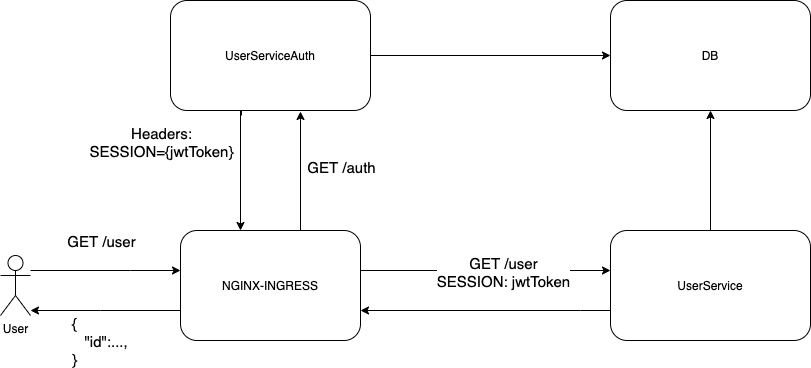

### Задание №5

Запуск приложения: `bash ./service.sh install`

Остановка приложения: `bash ./service.sh destroy`

Архитектура решения

[Коллекция с тестами postman](./OtusHomework5.postman_collection.json)
